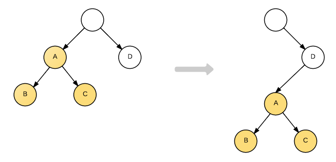
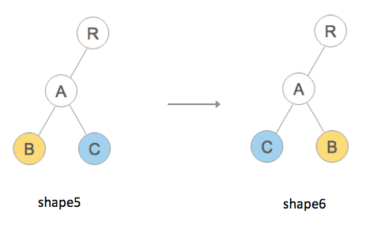

# 简单实现 DOM-diff

## 引入

前端开发关于性能优化有一个原则：**尽量减少 DOM 操作**。因为 DOM 操作会引起浏览器的重绘、回流，这就是比一个 js 语句执行慢很多的过程。而 React 在方面的表现格外优异，性能强大、渲染效率高。

在 React 中，在 JSX 到 DOM 的转换过程中，会先构建 `Virtual DOM` ，也就是虚拟节点，它通过 Javascript 的 Object 对象模拟 DOM 中的节点，然后再通过特定的 render 方法将其渲染成真实的 DOM 节点。

每次更新时，自上而下渲染 React 组件，都会对比此次和上次的 Virtual DOM ，然后只修改其中的差别部分，**只做最小的必要改动，以此提高渲染效率**。

更新中这个“找不同”的过程，叫做`调和（Reconciliation）`，它的实现就是依赖于我们要实现的 `DOM diff 算法`。 DOM diff 则是通过 Javascript 层面的计算，返回一个 `patch` 对象（即补丁对象），在通过特定的操作解析 patch 对象，完成页面的重新渲染。

## 过程（思路）

1. 生成 Virtual DOM 
    - 用 JavaScript 对象模拟 DOM
2. 渲染 DOM 
    - 把 Virtual DOM 转成真实 DOM 并插入页面中
3. 修改 Virtual DOM
    - 根据更新内容修改 Virtual DOM
4. 差异比较
    - 比较两棵 Virtual DOM 树的差异，得到差异对象 patch
5. 更新 DOM 
    - 把差异对象应用到真正的 DOM 树上

# 一、创建+渲染 Virtual DOM 

## 1、描述 

> 将 DOM 节点抽象成 JS 对象结构来描述，即将 DOM 树转换成 Virtual DOM 树。

描述一个节点有以下三项内容：
- 节点类型 String
- 节点属性 Object
- 子节点 Array

## 2、渲染

> 将 Vritual DOM 数渲染成真实 DOM 节点，插入 HTML 文档中

按照上面三项内容逐一处理：
- 创建节点
    - document.createElement(tagName);
- 添加属性
    - style
        - Element.style.cssText = value;
    - value
        - input 或 textarea 输入框， Element.value = value;
        - 其他 Element.setAttribute(name, value);
    - 其他
        - Element.setAttribute(name, value);
- 生成子节点
    - 说明
        - 生成子节点应该是在生成父节点之后，所以 render 的过程是`先序遍历`
    - 创建
        - 文本类型
            - document.createTextNode(data)
        - 节点类型
            - 调用子节点 render 方法，递归处理
    - 插入
        - father.appendChild(child);

## 3、测试

见 src/1.js 

# 二、差异比较 patch

## 1、比较策略

> 对比两个 N 个节点的树形结构的算法，时间复杂度是 O(N³)，这是非常低的，所以 diff 算法采用了一些优化策略，将时间复杂度降到了 O(N) 。

### a. 只在同级之间，顺序进行对比

- DOM 节点的跨级移动操作特别少，所以忽略这种情况
- 只对比同级节点，可以有效降低计算复杂度
    - `节点类型相同则只更新`
        - 文本节点，直接更新修改部分
        - DOM 元素，保留并更新修改部分
        - React 组件，根据 props 更新组件实例
    - `节点类型不同则直接卸载`

同级、顺序对比：


主观上黄色结构未改变，可以直接复用，实际上会先移除，然后再在 D 下重新创建：


### b. 列表渲染添加 key

- 直接找出两个序列的差异，算法时间复杂度是 O(N²)
- 采用的从前向后逐一比对，`同位置不一致则移除重建`
- 当添加了`序列中唯一不变 key `时，位置不一致的同一元素也可以保持稳定，不必重新渲染

添加了 key 后，下面改变不会触发更新：


## 2、查找约定

### 描述约定

```js
var patches = { // 用一个对象来描述差异对象
    index: [ // key 是节点在旧树中的索引，遍历顺序见下面
        {
            type: XXX, // 每个差异描述都必定有个 type 描述差异类型，删除、文本修改、属性修改、节点调换
            other: yyy // 不同差异需要不同的配合数据，可能是删除索引、新文本、新属性、新节点
        }
    ]
}
```

### 对比顺序

`先序遍历:`


## 3、找差异之一（忽略 key）

按照上面的比较策略，我们先看第一条，`只在同级之间，顺序进行对比`，就会有下面的比对过程（由简入繁）：

1. 是否被删除，如果没有新节点且不是文本节点，表示被删除（文本节点可能为空）
2. 是否文本更新，如果新旧节点都是文本，且不同
3. 是否属性更新，如果新旧节点类型相同，但是属性不同
4. 是否有子节点，如果新旧节点类型相同且有子节点，则遍历子节点对比
5. 除了以上，就只有全替换节点了

补充：上面的变化是互斥的，节点、属性、子节点(包括文本)只修改一个。因为，如果 nodeName 不同了，后续的属性与子节点的改变都不必理会，直接删除重建整个节点即可；如果子节点改变也和当前节点没关系，改变描述是属于子节点的。综上，不需要用数组存储修改内容，直接用 index 保存差异描述对象即可。

测试见 src/2.js 

# 三、打补丁（处理差异）

打补丁和找差异的过程类似，区别在于：
1. 遍历顺序
    - 找差异，`先序遍历`，先处理父节点再处理子节点
    - 打补丁，`后序遍历`，先处理子节点再处理父节点
2. 操作对象
    - 找差异，自定义 Element
    - 打补丁，原生 Node Element

处理的过程依然按照约定的几种改变描述，进行对应处理。